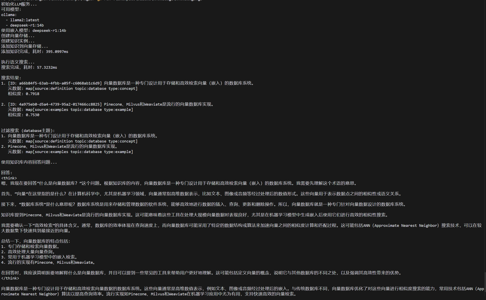

# Aegis - AI Agent 

Aegis 是一个用 Go 语言开发的 AI Agent 框架，旨在提供灵活、可扩展的智能代理系统。该框架支持知识库管理、记忆系统、工具注册和执行等功能，使开发者能够构建复杂的 AI 代理应用。

## 项目结构

```
Aegis/
├── examples/
│   ├── ollama/       # ollama 示例
├── internal/
│   ├── agent/        # Agent 管理系统
│   ├── knowledge/    # 知识库系统
│   ├── memory/       # 记忆系统
│   └── tool/         # 工具系统
└── README.md
```

## 开发进度

[TODO.md](TODO.md)
## 使用示例

```bash
go run examples/ollama/knowledge/knowledge.go
```




## 贡献

欢迎提交 Issues 和 Pull Requests 来帮助改进这个项目。

## 许可证

[MIT](LICENSE) 